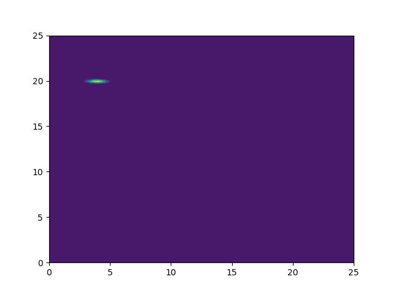
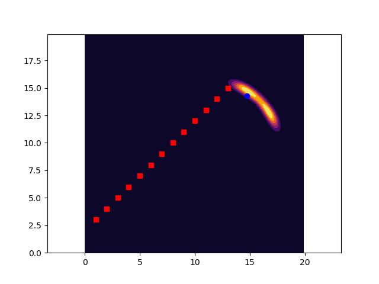

# Multi-robot Target Tracking

### Author
Arpit Aggarwal
Lifeng Zhou

### Sample Output

### Instructions for running the code

### Software Required
To run the .py files, use Python 3. Standard Python 3 libraries like OpenCV, Numpy, scipy, and matplotlib are used.
