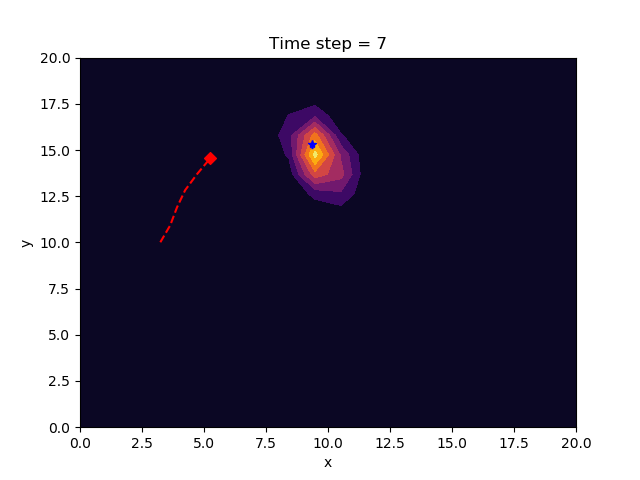
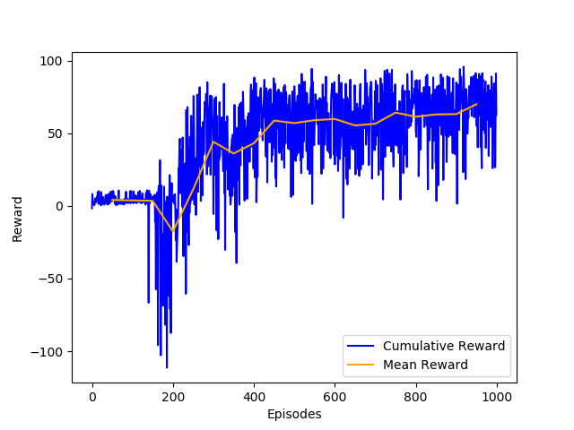
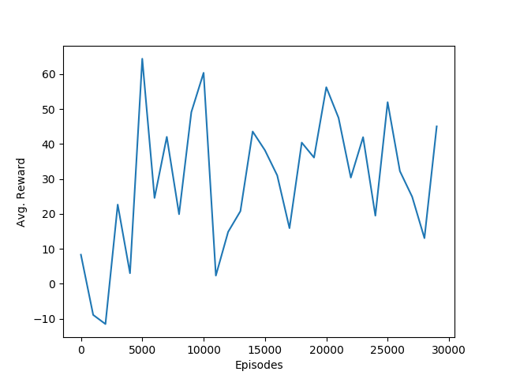

# Multi-robot Target Tracking

### Author
Arpit Aggarwal
Lifeng Zhou

### Results

Robot path (after training Actor-critic model)
 

Reward vs Episodes curve (Actor-critic model training)
 

Performance of Q-Learning Algorithm (Episodes=30000, LR=0.1, DISCOUNT=0.95, EPSILON=0.5)

Greedy algorithm using EKF(Target moving slow)

Greedy algorithm using EKF(Target moving fast)

Greedy algorithm using BH(Target moving slow)

Greedy algorithm using BH(Target moving fast)

### Instructions for running the code

### Software Required
To run the .py files, use Python 3. Standard Python 3 libraries like OpenCV, Numpy, scipy, and matplotlib are used.
